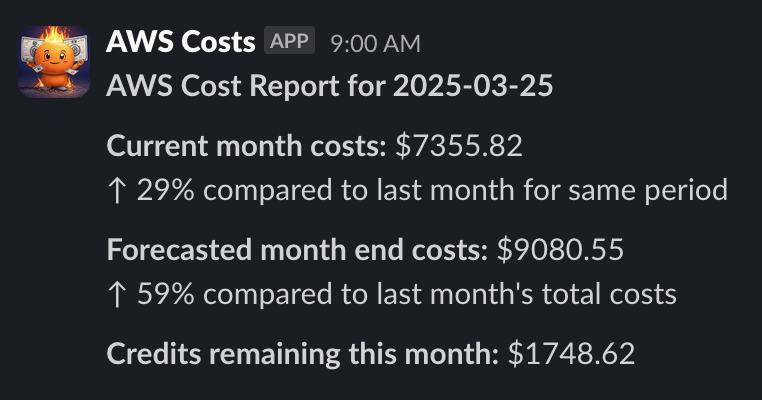

# AWS Cost Monitor

A CloudFormation template for AWS cost monitoring and Slack notifications developed by [DNX Solutions](https://www.dnx.solutions/).

## Overview

AWS Cost Monitor is a serverless solution that provides daily or scheduled cost monitoring and forecasting for your AWS account. It sends automated notifications to a Slack channel with real-time cost data.

The tool helps teams maintain visibility of AWS costs, track budget trends, and quickly identify unexpected spending increases.

## Features

- **Current Month Costs**: Reports total usage costs for the current month
- **Cost Forecasting**: Predicts end-of-month costs based on current usage patterns
- **Trend Analysis**: Compares current costs with previous month's spending
- **Credit Tracking**: Shows how many AWS credits have been applied this month
- **Customizable Schedule**: Run on your preferred cadence (daily, specific weekdays, etc.)
- **Serverless Architecture**: No infrastructure to maintain
- **Simple Deployment**: Single-click deployment through CloudFormation

## Architecture

The solution uses the following AWS services:

- **AWS Lambda**: Executes the cost analysis code
- **AWS Cost Explorer API**: Retrieves current and forecasted cost data
- **Amazon EventBridge**: Schedules regular cost reporting
- **AWS IAM**: Manages permissions for accessing cost data
- **Slack Webhooks API**: Delivers notifications to your team

## Installation

### Prerequisites

- An AWS account with permissions to create Lambda functions, IAM roles, and EventBridge rules
- A Slack workspace with permissions to create webhook integrations

### Deployment Steps

1. Create a Slack webhook URL:
   - Go to your Slack workspace's App Directory
   - Create a new app or use an existing one
   - Enable Incoming Webhooks
   - Create a new webhook for the channel where you want to receive notifications
   - Copy the webhook URL

2. Deploy the CloudFormation template:
   - Log in to the AWS Console of your Management account (the account that manages the AWS Organization)
   - Change to `us-east-1` region (N. Virginia)
   - Navigate to CloudFormation
   - Click "Create stack" > "With new resources (standard)"
   - Upload the template file or use an S3 URL
   - Fill in the parameters:
     - `SlackWebhookUrl`: The webhook URL from step 1
     - `NotificationTime`: The cron expression for when to send notifications

3. Wait for the stack creation to complete (typically 1-2 minutes)

4. Verify the installation by checking your Slack channel for cost notifications

## Configuration Options

The CloudFormation template accepts the following parameters:

| Parameter | Description | Default |
|-----------|-------------|---------|
| `SlackWebhookUrl` | The Slack webhook URL to post cost notifications | (Required) |
| `NotificationTime` | Cron expression for when to send notifications | `0 9 ? * MON,WED,FRI *` (9 AM UTC on Mon, Wed, Fri) |

## Cost Considerations

This solution uses the following AWS services that may incur charges:

- **AWS Lambda**: The function executes briefly once per scheduled run. This typically stays within the AWS Free Tier.
- **AWS Cost Explorer API**: The API has a cost associated with each API call. This solution makes three API calls per execution.

Overall, the cost to run this solution should be minimal (typically less than $1 per month).

## Customization

### Changing the Schedule

To change when notifications are sent, update the `NotificationTime` parameter with a different cron expression:

- Daily at 9 AM UTC: `0 9 * * ? *`
- Weekdays at 9 AM UTC: `0 9 ? * MON-FRI *`
- Every 6 hours: `0 0/6 * * ? *`

### Adding Additional Metrics

The Lambda function can be modified to include additional cost metrics or filtering by:
- AWS service
- Tag
- Account (for AWS Organizations)
- Region

## Troubleshooting

Common issues:

1. **No notifications received**:
   - Check that the Slack webhook URL is correct
   - Verify the Lambda execution role has proper permissions
   - Check Lambda CloudWatch logs for errors

2. **Missing or incorrect data**:
   - Ensure Cost Explorer is enabled in your account
   - The Cost Explorer API has a 24-hour data freshness delay
   - Verify IAM permissions include `ce:GetCostForecast` and `ce:GetCostAndUsage`

## License

This project is licensed under the MIT License - see the LICENSE file for details.

## Contributing

Contributions are welcome! Please feel free to submit a Pull Request.

## About DNX Solutions

[DNX Solutions](https://www.dnx.solutions/) specializes in AWS Cloud solutions and services, helping businesses leverage the power of cloud computing.